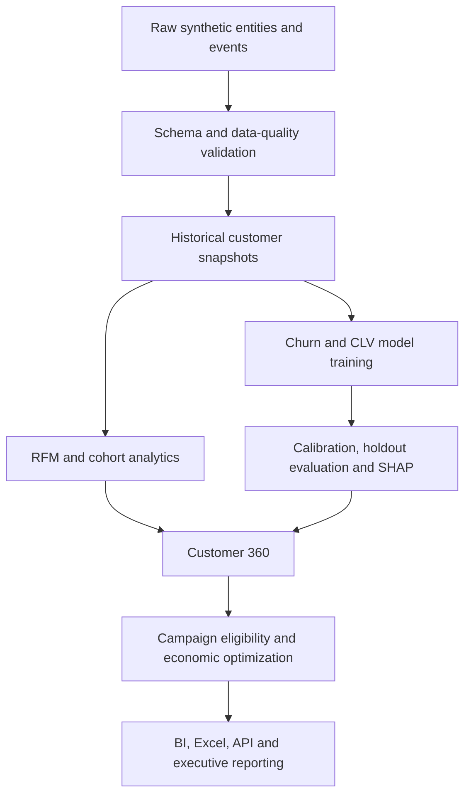

# Solution Architecture

## Objective

The platform converts customer transactions and behavioral signals into a governed customer-level decision record. Every delivery channel reads validated outputs produced by the same Python and SQL logic.

## Logical Layers

| Layer | Components | Responsibility |
|---|---|---|
| Source | Customers, products, orders, order lines, interactions, campaigns, calendar | Synthetic relational business events |
| Processing | Python, pandas, feature pipeline | Validation, aggregation and feature creation |
| Analytics | RFM, cohort, CLV, churn, SHAP | Descriptive and predictive customer intelligence |
| Decision | Eligibility, consent, treatment cost, expected value, budget | Next-best-action selection |
| Storage | CSV analytical outputs and SQLite | Portable, auditable analytical layer |
| Delivery | Power BI, Excel, Tableau, Streamlit, FastAPI, PDF, PowerPoint | Role-specific consumption |
| Governance | Pytest, Ruff, CI, data quality, fairness, drift, model cards | Control and reproducibility |

## End-to-End Flow

## Grain and Keys

- `customer_id` is the customer-level analytical key.
- `order_id` is unique in the order fact.
- `order_line_id` is unique in the order-line fact.
- `product_id` links each line to the product dimension.
- `campaign_id` identifies campaign definitions and responses.
- `date` and `month` connect time-based facts to the calendar.

## Deployment Boundaries

The portfolio runs locally and in containers. The API loads serialized champion models and applies the same feature schema used in training. Production deployment would externalize:

- secrets and environment configuration;
- object/model storage;
- feature-store or warehouse connectivity;
- authentication and rate limiting;
- experiment tracking;
- central monitoring and alerting.

