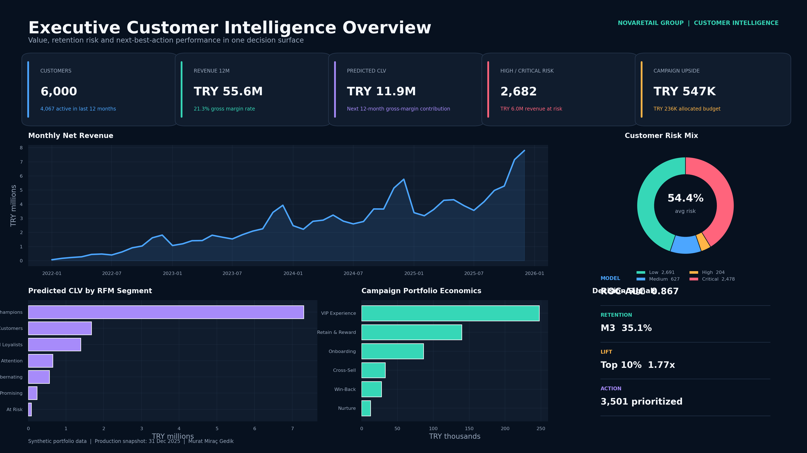
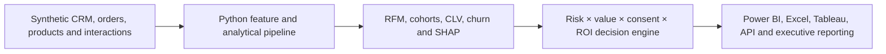

# Customer Intelligence, CLV & Churn Prediction Platform



An end-to-end customer analytics and decision-intelligence portfolio project that transforms four years of synthetic retail data into customer segmentation, cohort retention, predictive customer lifetime value, calibrated churn risk, SHAP explanations and economically governed next-best-action recommendations.

The solution is designed as a complete analytical product rather than a standalone dashboard. It combines a reproducible Python pipeline, relational SQL layer, machine-learning models, explainability, an API, an analytical application, Power BI, Tableau, a formula-driven Excel campaign planner, bilingual executive presentations, a vector PDF report, automated tests and model-governance documentation.

> **Portfolio note:** NovaRetail Group is fictional. Every record is synthetic and no real personal data is used.

## Executive Snapshot

| KPI | Result |
|---|---:|
| Customers | 6,000 |
| Active customers, last 12 months | 4,067 |
| Net revenue, last 12 months | TRY 55.6M |
| Predicted 12-month CLV | TRY 11.9M |
| High / critical-risk customers | 2,682 |
| Revenue at risk | TRY 6.0M |
| Churn champion ROC-AUC / PR-AUC | 0.867 / 0.908 |
| Lift in top 10% | 1.77x |
| CLV champion MAE / R² | TRY 1,258 / 0.564 |
| Prioritized campaign targets | 3,501 |
| Allocated campaign budget | TRY 236K |
| Expected incremental margin | TRY 547K |

## Business Questions

- Which customer groups create the highest current and future economic value?
- Which acquisition cohorts retain most effectively after the first purchase?
- Which customers are most likely to churn within the next 90 days?
- Why did the model assign a specific risk probability?
- Which high-risk customers are economically worth contacting?
- Which action should be recommended, and how much campaign budget should be allocated?
- Are model performance, fairness, feature stability and data quality still within control limits?

## Solution Architecture



The project uses a customer-level production snapshot dated **31 December 2025**. Historical snapshots are built separately for model development and time-based validation, preventing future information from leaking into training features.

## Analytical Modules

### RFM Segmentation

Customers are scored on recency, frequency and monetary value and translated into business-oriented groups including Champions, Loyal Customers, Potential Loyalists, Need Attention, Hibernating, Promising and At Risk. Segment summaries connect population size to revenue, margin, predicted CLV, churn risk and expected campaign value.

### Cohort Retention

First-purchase cohorts are followed from M0 through M12. The matrix exposes acquisition-quality differences and early retention decay that aggregate active-customer metrics can hide.

### Predictive CLV

The CLV target is the customer’s realized gross-margin contribution over the following 365 days. Random Forest Regressor is the selected champion based on time-based holdout performance and value-ranking quality.

### Churn Prediction

The churn target represents no purchase during the following 90 days. The champion is a calibrated Random Forest classifier. Candidate models are compared with ROC-AUC, PR-AUC, Brier score, F1, precision, recall and top-decile lift.

### SHAP Explainability

Permutation-based SHAP analysis produces global feature importance and local reason codes. Explanations support review and communication; they are not treated as causal evidence.

### Campaign Decisioning

Next-best-action rules combine:

- churn probability and risk band;
- predicted CLV and recent gross margin;
- RFM segment;
- marketing consent;
- expected response and treatment cost;
- expected incremental margin and ROI;
- total campaign budget constraints.

The resulting actions include VIP Experience, Retain & Reward, Onboarding, Cross-Sell, Win-Back, Nurture and Suppress.

## Model Results

### Churn Champion

| Metric | Holdout Result |
|---|---:|
| Model | Random Forest, calibrated |
| ROC-AUC | 0.8666 |
| PR-AUC | 0.9083 |
| Brier score | 0.1455 |
| F1 | 0.7917 |
| Precision | 0.8085 |
| Recall | 0.7755 |
| Lift at top 10% | 1.7738x |
| Operating threshold | 0.33 |

### CLV Champion

| Metric | Holdout Result |
|---|---:|
| Model | Random Forest Regressor |
| MAE | TRY 1,258.38 |
| RMSE | TRY 2,151.56 |
| R² | 0.5645 |
| Spearman correlation | 0.7915 |

## Professional Deliverables

| Area | Deliverable |
|---|---|
| Python | Reproducible data generation, feature engineering, analytics, modeling, explainability and decision pipeline |
| SQL | Relational schema, analytical views, reusable queries and populated SQLite database |
| Power BI | 12-page PBIP project, embedded semantic data and reusable DAX measure library |
| Excel | 24-sheet formula-backed customer intelligence and campaign planning model |
| Tableau | 3 dashboards and 8 analytical worksheets |
| API | FastAPI customer-scoring service with request validation |
| Application | Streamlit customer intelligence exploration app |
| Testing | 28 passing tests, 100% API coverage and 10/10 data-quality gates |
| Security / CI | Ruff, Pytest, coverage enforcement and GitHub Actions workflow |
| Presentations | 20-slide English and 20-slide Turkish professional decks |
| Executive report | 12-page vector-first HD PDF |
| Documentation | Methodology, model cards, data card, KPI dictionary, campaign playbook, monitoring and privacy guidance |

## Repository Structure

```text
customer-intelligence-clv-churn-prediction-platform/
├── API/                    # FastAPI scoring service
├── App/                    # Streamlit analytical application
├── Data/
│   ├── Raw/                # Synthetic source tables
│   └── Processed/          # Validated analytical outputs
├── Delivery/               # LinkedIn, GitHub and executive hand-off materials
├── Docs/                   # Methodology, governance and user documentation
├── Excel/                  # Formula-driven Excel decision model
├── Images/                 # 4K dashboard and portfolio images
├── Models/                 # Serialized churn and CLV champions
├── Notebooks/              # Guided analytical walkthrough
├── PowerBI/                # PBIP project, ZIP package and DAX measures
├── Presentation/           # English and Turkish PowerPoint decks
├── Python/src/             # Reusable Python package
├── Reports/                # Vector HD executive PDF
├── SQL/                    # Schema, views, queries and SQLite database
├── Tableau/                # Tableau workbook
├── tests/                  # Automated unit and integration tests
├── Dockerfile
├── docker-compose.yml
├── Makefile
├── pyproject.toml
└── requirements.txt
```

## Quick Start

### 1. Create the Python environment

```bash
python -m venv .venv
```

Activate it and install the project:

```bash
pip install -e ".[dev]"
```

### 2. Run the complete pipeline

```bash
make pipeline
```

The pipeline regenerates synthetic source data, features, analytical tables, models, SHAP outputs, campaign recommendations and the SQLite layer.

### 3. Run quality checks

```bash
make lint
make test
```

### 4. Start the API

```bash
uvicorn API.main:app --reload
```

Open `http://127.0.0.1:8000/docs` for Swagger UI.

### 5. Start the Streamlit application

```bash
streamlit run App/streamlit_app.py
```

## How to Open the BI Files

- **Power BI:** Open [Customer_Intelligence_Analytics.pbip](PowerBI/Customer_Intelligence_PBIP/Customer_Intelligence_Analytics.pbip) with a current Power BI Desktop release. The semantic model uses embedded Power Query data, so source-path remapping is not required.
- **Excel:** Open [Customer_Intelligence_CLV_Churn_Campaign_Planner.xlsx](Excel/Customer_Intelligence_CLV_Churn_Campaign_Planner.xlsx). Yellow cells on the Assumptions sheet are editable inputs; green values are formulas or linked outputs.
- **Tableau:** Open [Customer_Intelligence_Dashboard.twb](Tableau/Customer_Intelligence_Dashboard.twb). If prompted, point the data source to `Data/Processed/customer_360.csv`.
- **Executive PDF:** Open [Customer_Intelligence_Executive_Report_12_Page_Vector_HD.pdf](Reports/Customer_Intelligence_Executive_Report_12_Page_Vector_HD.pdf).
- **English presentation:** Open [Customer_Intelligence_CLV_Churn_Prediction_Professional_Deck_EN.pptx](Presentation/Customer_Intelligence_CLV_Churn_Prediction_Professional_Deck_EN.pptx).
- **Turkish presentation:** Open [Musteri_Zekasi_CLV_Churn_Tahmin_Platformu_Profesyonel_Sunum_TR.pptx](Presentation/Musteri_Zekasi_CLV_Churn_Tahmin_Platformu_Profesyonel_Sunum_TR.pptx).

## Quality & Governance

- 28 automated tests pass.
- API statement and branch coverage is 100%.
- All 10 pipeline data-quality checks pass.
- Model validation is time-based rather than randomly split.
- Churn probabilities are calibrated.
- PSI-based feature drift monitoring is included.
- Region and age-band fairness diagnostics are generated.
- Marketing consent is enforced in campaign eligibility.
- SHAP explanations are reviewed as associations, not causal claims.
- The project is intended for retention and marketing prioritization, not credit, employment, insurance or eligibility decisions.

See [QA Report](Delivery/QA_Report.md), [Churn Model Card](Docs/model_card_churn.md), [CLV Model Card](Docs/model_card_clv.md) and [Privacy & Ethics](Docs/privacy_ethics.md).

## Limitations

- Data is synthetic and does not establish real-world commercial uplift.
- Campaign economics are expected-value estimates and require controlled experiments.
- CLV represents a 12-month gross-margin horizon, not an unlimited customer lifetime.
- Churn is defined by purchase inactivity and may not represent every business model.
- Fairness diagnostics are monitoring indicators, not a legal compliance determination.

## Author

**Murat Miraç Gedik**

Customer Analytics • Machine Learning • SQL • Power BI • Excel • Tableau • Decision Intelligence

## License

Released under the [MIT License](LICENSE).
